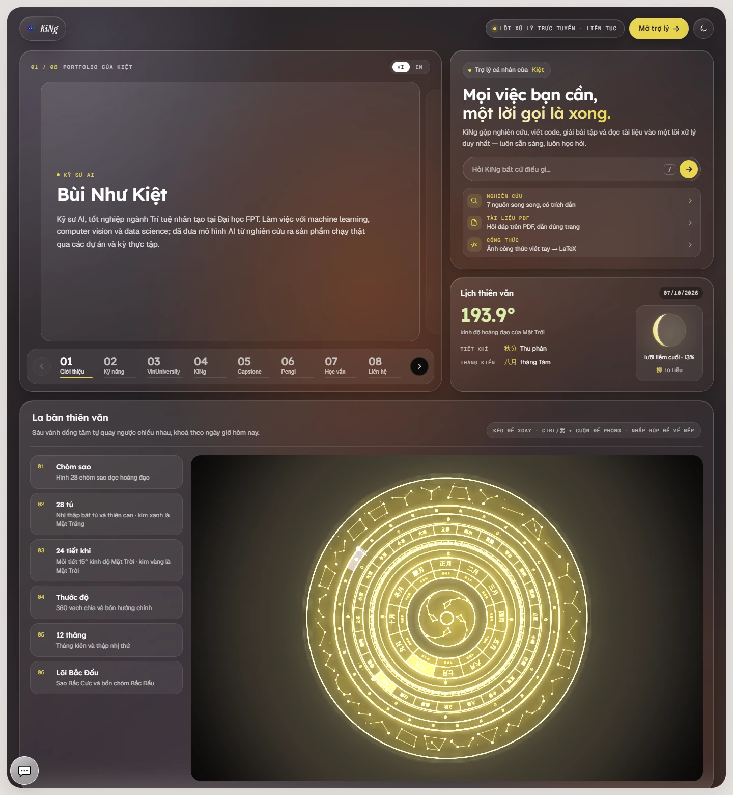
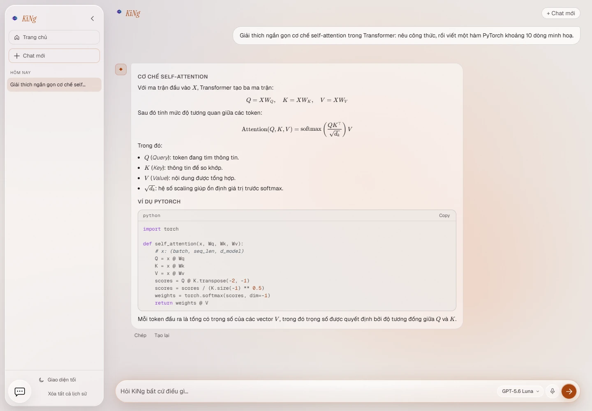
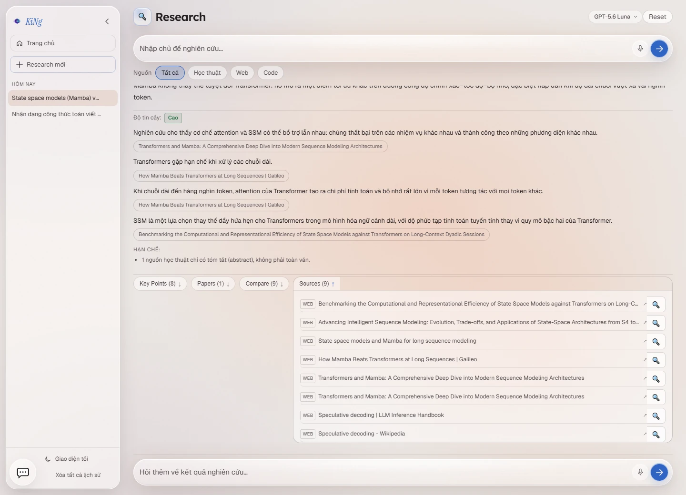
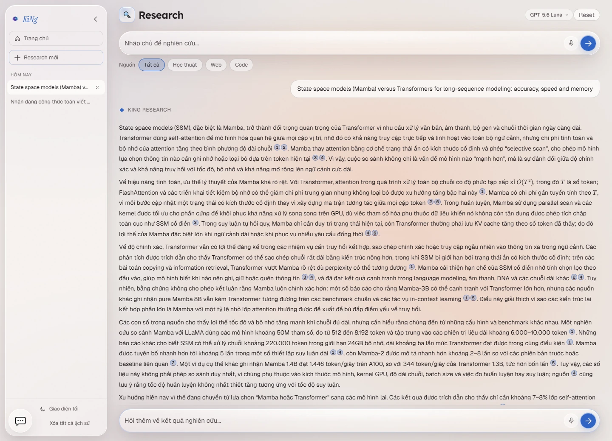
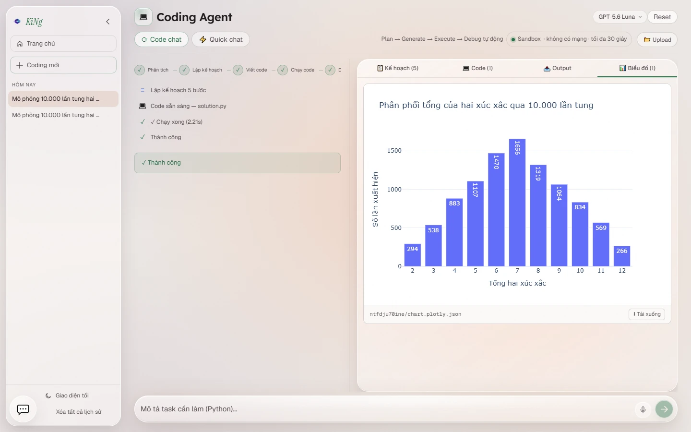
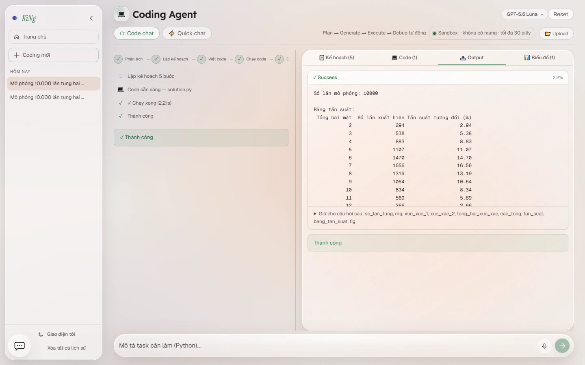
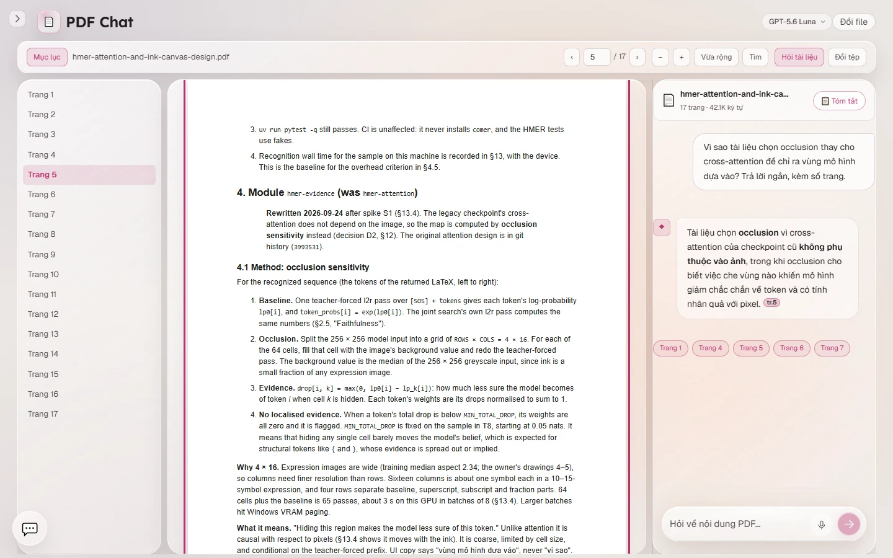
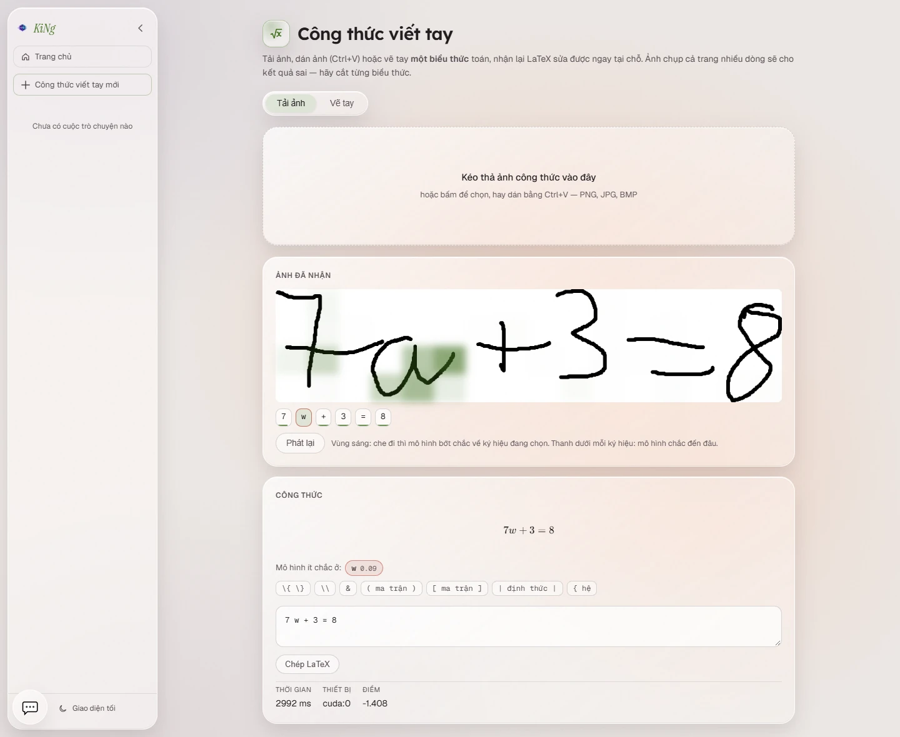
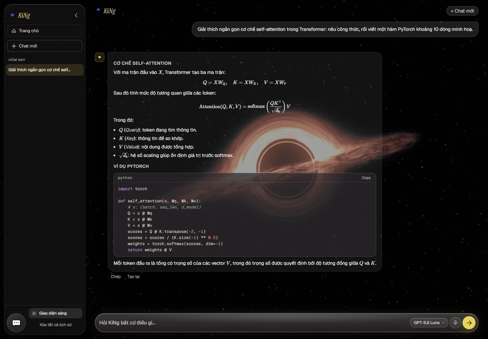

# KiNg — Trợ lý AI cá nhân

<p align="center">
  
</p>

<p align="center">
  <em>Một trợ lý AI cá nhân, với 1 số tác vụ chính: trò chuyện,
  nghiên cứu đa nguồn có trích dẫn, viết &amp; chạy code Python trong sandbox, hỏi đáp trên
  PDF, nhận dạng công thức toán viết tay, và điểm tin AI hằng ngày.</em>
</p>

<p align="center">
  <a href="https://github.com/NhuKiet/Persional-AI-Assistant/actions/workflows/ci.yml"></a>
  
  
  
  
  
</p>

<p align="center">
  
</p>

KiNg là dự án cá nhân của **Bùi Như Kiệt**: frontend sử dụng React + TypeScript, backend sử dụng FastAPI,
mọi câu trả lời dài stream về trình duyệt theo thời gian thực bằng Server-Sent Events.
Model đổi được ngay trên giao diện, không cần khởi động lại, giữa **Ollama** (chạy local),
**OpenAI API** , và **Anthropic Claude API**.

> [!NOTE]
> KiNg được làm cho một người dùng, chạy trên máy của chính họ, và có thể mở cho vài khách
> dùng thử qua internet. Nó có đăng nhập, phân quyền và hạn mức cho khách, nhưng không phải
> dịch vụ nhiều người dùng: backend chạy một worker, hạn mức và khoá phiên nằm trong bộ nhớ.

---

## ⭐ Điểm nổi bật

- **Research có kiểm chứng.** Tìm song song trên nhiều nguồn, xếp hạng lại bằng
  cross-encoder, rồi viết báo cáo gắn trích dẫn từng câu. Kết quả kèm mức tin cậy, danh
  sách nhận định có nguồn, và mục "Hạn chế" nói rõ điều các nguồn không trả lời được.
  → [Nghiên cứu sâu](#nghiên-cứu-sâu-research) · [Pipeline RAG](#-pipeline-rag)
- **Code do LLM sinh chỉ chạy trong sandbox.** Mỗi lần chạy là một container Docker dùng
  một lần: không mạng, filesystem chỉ đọc, bỏ hết Linux capability, có trần RAM / CPU /
  số tiến trình / thời gian. → [Sandbox thực thi code](#-sandbox-thực-thi-code)
- **Nhận dạng công thức viết tay có giải thích.** Mô hình SwinCoMER từ đồ án tốt nghiệp,
  kèm mapping cho biết mỗi ký hiệu được đọc từ vùng mực nào và ký hiệu nào mô hình ít chắc.
  → [Công thức viết tay](#công-thức-viết-tay-hmer)
- **Hỏi đáp PDF dẫn đúng trang.** Câu trả lời gắn số trang; bấm vào là trình xem nhảy tới
  trang đó. → [Trợ lý PDF](#trợ-lý-pdf-pdf)
- **Đủ lớp bảo vệ để mở ra internet.** Đăng nhập chủ + khách dùng thử theo hạn mức mỗi IP,
  phân quyền chặn mặc định, chống CSRF, rate limit, allow-list model, CSP và security
  header, HTTPS qua Cloudflare Tunnel. Backend từ chối khởi động khi cấu hình hở.
  → [Đăng nhập & dùng thử](#-đăng-nhập--dùng-thử) · [Mở ra internet](#-mở-ra-internet-cloudflare-tunnel)
- **Có kiểm thử và CI.** Khoảng 1.000 test backend (pytest) và 500 test frontend (Vitest),
  lint, typecheck, build, và kiểm tra lỗ hổng dependency hằng tuần trên GitHub Actions.
  → [Kiểm thử & CI](#-kiểm-thử--ci)
- **Có công cụ vận hành.** Trạng thái từng năng lực (`/health/capabilities`), độ trễ p50/p95
  theo tính năng (`/health/latency`), và sao lưu database có khôi phục thử.
  → [Sao lưu & khôi phục dữ liệu](#-sao-lưu--khôi-phục-dữ-liệu)

---

## Mục lục

- [Điểm nổi bật](#-điểm-nổi-bật)
- [Tính năng](#-tính-năng)
- [Giao diện](#-giao-diện)
- [Kiến trúc](#-kiến-trúc)
- [Pipeline RAG](#-pipeline-rag)
- [Công nghệ](#-công-nghệ)
- [Yêu cầu hệ thống](#-yêu-cầu-hệ-thống)
- [Cài đặt & chạy local](#-cài-đặt--chạy-local)
- [Chạy bằng Docker Compose](#-chạy-bằng-docker-compose)
- [Mở ra internet (Cloudflare Tunnel)](#-mở-ra-internet-cloudflare-tunnel)
- [Sandbox thực thi code](#-sandbox-thực-thi-code)
- [Đăng nhập & dùng thử](#-đăng-nhập--dùng-thử)
- [Sao lưu & khôi phục dữ liệu](#-sao-lưu--khôi-phục-dữ-liệu)
- [Cấu hình (.env)](#️-cấu-hình-env)
- [API](#-api)
- [Kiểm thử & CI](#-kiểm-thử--ci)
- [Cấu trúc dự án](#-cấu-trúc-dự-án)
- [Tác giả](#-tác-giả)

---

## ✨ Tính năng

### Trang chủ (`/`)

Trang chủ (ảnh đầu README) là một dashboard, vừa là portfolio của tác giả vừa là cửa
vào trợ lý:

- **Portfolio dạng thẻ**, tám thẻ, song ngữ Việt / Anh: giới thiệu, kỹ năng, kinh nghiệm,
  dự án, học vấn, liên hệ.
- **Ô hỏi nhanh** đưa câu hỏi thẳng sang trang chat, kèm lối tắt tới Research, PDF và
  Công thức viết tay.
- **Lịch thiên văn**: kinh độ hoàng đạo của Mặt Trời, tiết khí, tháng kiến, pha Mặt Trăng và tú.
  Tất cả tính ngay trên trình duyệt từ ngày giờ hiện tại.
- **La bàn thiên văn 3D** dựng bằng **Three.js**: sáu vành đồng tâm (chòm sao, 28 tú,
  24 tiết khí, thước độ, 12 tháng, lõi Bắc Đẩu) quay ngược chiều nhau và khoá theo ngày
  giờ hôm nay. Kéo để xoay, Ctrl/⌘ + cuộn để phóng, nhấp đúp để về vị trí ban đầu. Cảnh
  3D được nạp lười sau phần còn lại của trang, tôn trọng `prefers-reduced-motion`, và có
  hình tĩnh thay thế khi máy không khởi tạo được WebGL.

### Trò chuyện (`/chat`)

<p align="center">
  
</p>

- Stream phản hồi theo thời gian thực qua **SSE**; dừng giữa chừng hoặc tạo lại câu trả lời.
- **Model Picker** đổi provider / model ngay trên ô nhập (Ollama · OpenAI /
  OpenAI-compatible · Anthropic).
- Render Markdown, **công thức toán bằng LaTeX**
- Lịch sử hội thoại lưu trên **Supabase (Postgres)**; danh sách phiên ở sidebar, mở lại
  được từng phiên.

### Nghiên cứu sâu (`/research`)

<p align="center">
  
</p>

- **Tìm song song các nguồn**: Tavily Web, DuckDuckGo, arXiv, Semantic Scholar, Hugging
  Face Papers, Stack Overflow. Chọn phạm vi *Tất cả / Học thuật / Web / Code* ngay dưới ô
  nhập. Một nguồn lỗi hay bị giới hạn tần suất thì lượt chạy vẫn đi tiếp với các nguồn còn
  lại.
- **Knowledge Gate**: trước khi tìm, hệ thống xét tri thức đã lưu cho câu hỏi này đầy đủ
  tới đâu (`EMPTY` / `STALE` / `THIN` / `MAYBE`) để quyết định trả lời luôn, tìm bổ sung,
  hay tìm mới hoàn toàn.
- **Làm giàu & reranker**: tải toàn văn trang web bằng Trafilatura, khử trùng lặp, rồi
  rerank bằng cross-encoder `BAAI/bge-reranker-v2-m3` chạy local (hoặc Cohere Rerank nếu
  có key).
- **Báo cáo có trích dẫn**: mỗi câu gắn số nguồn. Bên dưới
  là **mức tin cậy**, các **nhận định kèm nguồn**, và mục **Hạn chế**. Biểu đồ chỉ được vẽ
  khi các con số kiểm chứng được trong nguồn.
- Các bảng *Key Points · Papers · Compare · Sources*, **deep dive** từng nguồn, và gợi ý
  câu hỏi tiếp theo.
- **Knowledge store (tuỳ chọn)**: hybrid search trên **Weaviate Cloud** + OpenAI
  Embeddings để dùng lại tri thức đã thu thập ở các lượt sau.

Thiết kế chi tiết và các số đo: [Pipeline RAG](#-pipeline-rag).

<details>
<summary>Xem thêm ảnh: báo cáo với trích dẫn từng câu</summary>
<p align="center">
  
</p>
</details>

### Coding Agent (`/coding`)

<p align="center">
  
</p>

- Vòng lặp tự động **Plan → Code → Execute → Debug**, tự sửa lỗi tối đa `MAX_DEBUG_ITER`
  vòng. Kết quả chia theo tab: kế hoạch, code, output, biểu đồ.
- **Biểu đồ tương tác**: code ghi figure Plotly ra JSON, trang vẽ lại bằng plotly.js (rê
  chuột, phóng to). Ảnh PNG / JPG / SVG và file HTML do code sinh ra cũng được hiển thị.
- **Giữ biến giữa các lượt**: biến của lần chạy thành công được lưu lại cho câu hỏi tiếp
  theo trong cùng phiên (tối đa 50 MB mỗi biến, 100 MB mỗi phiên).
- Upload dữ liệu để phân tích: CSV, TSV, TXT, JSON, JSONL, Excel, Parquet, XML.
- Hai chế độ: **Code chat** (chạy code thật) và **Quick chat** (hỏi nhanh, không chạy).
- Mọi lần chạy diễn ra trong **container Docker dùng một lần**. Xem
  [Sandbox thực thi code](#-sandbox-thực-thi-code).

<details>
<summary>Xem thêm ảnh: output và các biến được giữ lại</summary>
<p align="center">
  
</p>
</details>

### Trợ lý PDF (`/pdf`)

<p align="center">
  
</p>

- **Workspace chia đôi** tài liệu / hỏi đáp, kéo chỉnh tỉ lệ; tự đổi bố cục theo khổ màn
  hình (split ở desktop, drawer ở laptop, overlay ở màn hẹp).
- **Trích dẫn theo trang**: câu trả lời gắn chip số trang, bấm vào là trình xem nhảy tới
  trang đó (ảnh trên: câu trả lời dẫn `tr.5`, tài liệu đang mở trang 5).
- Trích xuất nội dung bằng **PyMuPDF**, render bằng **react-pdf / PDF.js**, có mục lục và
  tìm kiếm highlight trong trang.
- **Ghim ngữ cảnh**: bôi đen đoạn text hoặc khoanh vùng ảnh trên trang để hỏi riêng về
  phần đó (vùng ảnh đi qua model vision).
- Tóm tắt toàn tài liệu bằng một nút, và gợi ý câu hỏi sinh từ chính nội dung tài liệu.

### Công thức viết tay (`/hmer`)

<p align="center">
  
</p>

- Ảnh **một biểu thức** toán viết tay → LaTeX sửa được ngay tại chỗ, bằng mô hình
  **SwinCoMER** (encoder Swin Transformer V2 + decoder CoMER) từ đồ án tốt nghiệp. Trên
  GPU laptop (RTX 3050 Ti 4 GB) mỗi ảnh mất khoảng 3–5 giây.
- **Tải ảnh**, dán ảnh, hoặc **vẽ tay** trên canvas (chuột, bút, cảm ứng). Nét vẽ lưu dạng
  vector rồi được dựng lại khi gửi đi: cắt sát mực, nét dày cố định, đen trên trắng. Mô
  hình chỉ đọc được mực lấp đầy khung ảnh; gửi nguyên khung vẽ có lề rộng thì 0/100 biểu
  thức đúng, dựng lại thì 50/100.
- **Vùng mô hình dựa vào**: với mỗi ký hiệu LaTeX, che lần lượt từng ô của lưới 4×16
  trên ảnh và đo mô hình bớt chắc bao nhiêu (occlusion sensitivity). Rê chuột / Tab qua
  dải ký hiệu để xem vùng sáng, **Phát lại** để xem mô hình "đọc" cả biểu thức.
- **Ký hiệu ít chắc được đánh dấu.** Ảnh trên là một ca như vậy: mô hình đọc chữ `a` thành
  `w`, tự báo xác suất chỉ 0.09, và vùng sáng nằm đúng trên chữ `a`. Người dùng biết
  ngay cần sửa ký hiệu nào.
- Vì sao là occlusion chứ không phải attention: trên checkpoint hiện có, bản đồ
  cross-attention quét trái→phải theo bước giải mã **bất kể ảnh** — ảnh lật hay ảnh
  trắng cũng cho cùng đường chéo — còn occlusion dịch theo khi mực dịch. Số đo và
  phương pháp: `docs/superpowers/specs/2026-09-23-hmer-attention-and-ink-canvas-design.md`
  §13.4–13.6.

Cài đặt: xem [mục 7 của phần cài đặt](#7-tuỳ-chọn-bật-nhận-dạng-công-thức-viết-tay--hmer).

### Bong bóng "Trợ lý nhanh"

Bong bóng chat nổi ở mọi trang, bridge sang một dự án **ai-agent (Telegram bot)** chạy
riêng qua `BRIDGE_URL` / `BRIDGE_TOKEN`. Tách biệt hoàn toàn với chat chính của KiNg.

---

## 🎨 Giao diện

<table>
  <tr>
    <td></td>
    <td></td>
  </tr>
  <tr>
    <td align="center"><strong>Warm Paper</strong> — sáng, mặc định</td>
    <td align="center"><strong>Mực tối</strong> — nền hố đen dựng bằng shader</td>
  </tr>
</table>

Hệ thống thiết kế là **CSS thuần dựa trên design token**, không dùng thư viện component:

- Hai theme, đổi bằng một nút ở sidebar. Theme tối có nền hố đen vẽ bằng shader
  ray-marching trên WebGL (`frontend/src/three/blackhole`).
- Mỗi công cụ có màu nhấn riêng (chat, research, coding, PDF, công thức), nên nhìn màu là
  biết đang ở đâu.
- Icon điều hướng là SVG nội tuyến vẽ bằng `currentColor` để màu bám theo token của theme.
- Trang nặng được nạp lười theo route; cảnh 3D và plotly.js chỉ tải khi cần tới.

---

## 🏛 Kiến trúc

```text
Trình duyệt (React 18 + TypeScript, Vite)
        │  fetch + Server-Sent Events, cùng origin (/api)
        ▼
nginx (bản Docker) hoặc Vite proxy (dev)
        │  security header · CSP · IP thật của khách qua Cloudflare Tunnel
        ▼
FastAPI (Uvicorn)  ──►  LLM: Ollama | OpenAI-compatible | Anthropic
        │  đăng nhập · CSRF · rate limit · allow-list model
        │
        ├─► Supabase Postgres   (lịch sử phiên, tin nhắn, tin tức)
        ├─► Weaviate Cloud      (knowledge store — tuỳ chọn)
        ├─► Search APIs         (Tavily · DuckDuckGo · arXiv · S2 · HF · SO)
        ├─► Docker Executor     (container dùng một lần, chạy code sinh ra)
        └─► SwinCoMER trên GPU  (công thức viết tay — tuỳ chọn)
```

Backend cắt theo **feature slice**: mỗi tính năng là một thư mục riêng trong
`backend/app/features/` với router + service + schema của chính nó, dùng chung phần
`core/` (config, LLM factory, lifespan, capabilities, auth, CSRF, rate limit) và `shared/`
(conversation store, session lock, SSE, đo độ trễ). Có test canh **ranh giới giữa các
feature** để chúng không import chéo lung tung.

Frontend là **React Router v7 SPA**, mỗi tính năng một route. Trang chủ và trang chat
được nạp sẵn (eager) vì là điểm vào chính; các trang nặng — nhất là PDF, kéo theo
react-pdf + pdfjs worker — được **lazy-load** theo route. Mỗi route bọc trong
`ErrorBoundary` riêng nên một trang lỗi không kéo sập cả router.

Mọi thứ tuỳ chọn đều **hỏng mềm**: thiếu Weaviate, reranker, checkpoint HMER hay Docker
thì riêng phần đó báo `disabled` / `degraded` trong `/health/capabilities`, phần còn lại
của app vẫn chạy.

---

## 🧠 Pipeline RAG

Phần này đi theo một câu hỏi Research từ đầu tới cuối: hệ thống quyết định dùng tri thức
đã lưu hay đi tìm mới như thế nào, xếp hạng nguồn ra sao, và từng nhận định trong câu trả
lời được đối chiếu lại với nguồn bằng cách nào. Các con số lấy từ code và từ những lần đo
được ghi lại trong [`docs/superpowers/specs/`](docs/superpowers/specs), kèm ngày đo và cỡ
mẫu.

### Mục tiêu thiết kế

Ba yêu cầu được chốt từ đầu, mọi quyết định phía sau đều bám theo:

1. **Trả lời nông là lỗi nặng hơn trả lời chậm.** Tốn thêm vài giây để kiểm tra hoặc tìm
   bù còn hơn trả lời mỏng từ dữ liệu cũ.
2. **Tri thức mới có một phần thì bù phần thiếu, không vứt đi.**
3. **Độ mới tuỳ loại câu hỏi.** Câu hỏi khái niệm chấp nhận dữ liệu cũ; câu hỏi về SOTA,
   benchmark, phiên bản hay giá thì không.

### Luồng tổng quát

```text
câu hỏi
  └─► contextualize        viết lại câu hỏi nối tiếp thành câu độc lập (6 lượt gần nhất)
        └─► retrieve_candidates   hybrid search trên Weaviate: điểm thô + metadata độ mới
              │
   TẦNG 1  assess()        hàm thuần, không gọi LLM
              ├─ EMPTY   không có ứng viên ─────────────────► live search
              ├─ STALE   có, nhưng quá hạn với loại câu hỏi ─► live search (bỏ nguồn cũ)
              ├─ THIN    còn hạn nhưng phủ câu hỏi kém ─────► top-up search → trộn
              └─ MAYBE   còn hạn, phủ đủ
                    │
   TẦNG 2  judge_sufficiency()   một LLM call, đã gia cố
                    ├─ đủ ────► trả lời từ tri thức đã lưu (2 LLM call)
                    └─ thiếu ─► top-up search, neo vào câu hỏi gốc → trộn
              │
   TẦNG 3  synthesis → grounding → tối đa 1 vòng tìm bù → lưu nguồn MỚI vào store
```

Ba tầng vì mỗi tầng đứng một mình đều không đủ. Tín hiệu thuần không phân biệt được "YOLOv11
là gì" với "so sánh FLOPs backbone YOLOv11 và YOLOv8", vì hai câu phủ cùng token. Chỉ dùng
LLM judge thì tốn một call cho cả những ca không cần phán, như dữ liệu sáu tháng tuổi cho
câu hỏi SOTA. Còn tổng hợp trước rồi mới phát hiện thiếu thì đã tốn trọn bảy call.

### 1. Lưu tri thức

- **Parent–child chunking** (`chunking.py`). Nội dung nguồn được tách theo heading Markdown
  thành các *section* (parent), mỗi section lại cắt thành chunk 500 ký tự, overlap 50
  (child). Search chạy trên child vì chunk nhỏ khớp chính xác hơn, nhưng thứ trả về cho LLM
  là **nội dung parent**, để câu trả lời có đủ ngữ cảnh.
- **Embedding** từng child bằng OpenAI `text-embedding-3-small`; vector tự cấp cho Weaviate.
- Mỗi chunk mang theo nguồn, loại nguồn, URL, tiêu đề, câu hỏi đã sinh ra nó, thời điểm lưu
  và **ngày xuất bản** (arXiv cho ngày, Semantic Scholar cho năm). Hai mốc thời gian tách
  riêng vì một paper 2020 vừa index hôm nay không phải bằng chứng hiện hành.
- **Chỉ nguồn mới được ghi.** Khi top-up, nguồn lấy từ store không được ghi lại, nếu không
  mỗi lần hỏi cùng chủ đề sẽ nhân bản chunk. Tập "mới" được tính sau bước khử trùng lặp.
- Embed và ghi chạy nền song song với synthesis, nên người dùng không phải chờ việc chỉ có
  ích cho câu hỏi *sau*; lượt chạy chỉ báo xong khi đã ghi xong.

### 2. Retrieval

- **Hybrid search** của Weaviate: BM25 trên nội dung chunk kết hợp vector, `alpha = 0.5`,
  fusion `RELATIVE_SCORE`, lấy tối đa 80 hit rồi gộp theo parent.
- **Tách "có liên quan" khỏi "còn mới".** Bản đầu so ngưỡng với điểm đã nhân time-decay,
  nên tuổi tác *loại bỏ* chứ không *hạ hạng*: chunk điểm 1.0 biến mất sau khoảng 26 ngày,
  điểm 0.8 sau khoảng 12,5 ngày, và TTL 180 ngày không bao giờ có hiệu lực.
  `retrieve_candidates()` lọc theo điểm thô, chỉ dùng decay để sắp xếp, và nhường quyết định
  về độ mới cho tầng 1.

### 3. Knowledge gate

**Tầng 1** là hàm thuần, không I/O, không gọi LLM:

| Trạng thái | Điều kiện | Hành động |
|---|---|---|
| `EMPTY` | Không có ứng viên | Live search đầy đủ |
| `STALE` | Có ứng viên nhưng không cái nào còn trong TTL | Live search; nguồn cũ **không** đưa vào synthesis |
| `THIN` | Còn hạn nhưng coverage dưới 0.6 | Giữ nguồn còn hạn, top-up search, trộn. Không gọi judge |
| `MAYBE` | Còn hạn và coverage đủ | Tầng 2 quyết định |

- **TTL theo loại câu hỏi**: *volatile* 7 ngày (có từ như sota, benchmark, mới nhất, version,
  giá… hoặc nhắc tới năm nay / năm trước), *stable* 180 ngày (là gì, định nghĩa, kiến trúc,
  giải thích…), còn lại 30 ngày. Năm được tính động, không hardcode.
- **Tuổi bằng chứng** tính theo ngày xuất bản nếu biết, không thì theo ngày lưu. Nguồn không
  rõ tuổi bị loại với câu hỏi volatile.
- **Coverage** là tỉ lệ token của câu hỏi xuất hiện trong các nguồn *còn hạn*, không phải
  toàn bộ ứng viên: một đoạn mới mà lạc đề không được làm chín nguồn cũ trông như còn hạn.
  Tokenizer là Unicode; bản `[a-z0-9]+` ban đầu làm rụng hết chữ có dấu và xếp mọi câu hỏi
  tiếng Việt vào `THIN`.

**Tầng 2** là một LLM call trả về `{sufficient, missing}`, được gia cố vì nó đọc nội dung
lấy từ internet:

- Nội dung nguồn nằm trong khung "untrusted", tối đa 400 ký tự mỗi nguồn và 4.000 ký tự tổng.
- Chỉ `sufficient: true` kiểu boolean mới được tính là đủ; `"yes"` hay `1` bị coi là thiếu.
- Timeout 20 giây; lỗi hay quá giờ đều nghiêng về tìm thêm. Hủy được ngay cả khi call đang
  chạy.
- Query top-up **luôn neo vào câu hỏi gốc**: phần `missing` do judge viết chỉ được nối thêm
  vào sau, không bao giờ đứng một mình. Văn bản độc trong một nguồn vì thế không lái được
  lượt search.

### 4. Live search và top-up

- Các searcher chạy **song song** với deadline 60 giây. Khi đã có từ 4 kết quả, những nguồn
  còn đang chạy chỉ được thêm 10 giây.
- **Query expansion**: LLM sinh hai cách diễn đạt khác, chỉ dùng cho arXiv và Semantic
  Scholar, và chạy đè lên các search chính thay vì bắt chúng chờ.
- **Dynamic k**: số kết quả lấy từ mỗi nguồn đổi theo loại câu hỏi (học thuật / thực hành /
  chung).
- **Anchor filter**: bỏ kết quả không chung token thực chất nào với câu hỏi gốc của người
  dùng, không phải với query đã expand. Nếu filter định bỏ hơn 80% thì coi là lệch ngôn ngữ
  giữa câu hỏi và corpus, và giữ lại tất cả.
- **Enrich** kết quả web bằng Trafilatura để lấy toàn văn, có chặn SSRF (chỉ fetch địa chỉ
  IP công khai).
- **Khử trùng lặp** bằng cosine ≥ 0.92 trên embedding của tiêu đề + 300 ký tự đầu.
- **Rerank và score fusion**, giữ 15 nguồn tốt nhất:

| Tín hiệu | Trọng số |
|---|---|
| Cross-encoder (`bge-reranker-v2-m3` local, hoặc Cohere) | 0.55 |
| Độ tin cậy của loại nguồn | 0.20 |
| Độ mới, `exp(-tuổi / 5 năm)` | 0.10 |
| Số trích dẫn, trần 200 | 0.10 |
| Điểm gốc của nguồn | 0.05 |

Độ tin cậy theo nguồn: arXiv 1.0 · Semantic Scholar 0.95 · Hugging Face 0.80 · Stack
Overflow 0.70 · web 0.55 · DuckDuckGo 0.50. Khi không reranker nào chạy được, fusion tự
chuyển sang bộ trọng số không có cross-encoder (điểm gốc 0.40 · độ tin cậy 0.35 · trích dẫn
0.15 · độ mới 0.10) thay vì dừng. Khi top-up, nguồn lấy từ store được trộn với nguồn mới
rồi đi qua cùng bước rerank này.

### 5. Synthesis

- **Đường search / top-up**: các phần của báo cáo (tóm tắt, bản chi tiết, key points, biểu
  đồ, câu hỏi tiếp theo, danh sách paper, thêm bảng so sánh khi câu hỏi có ý so sánh) là các
  LLM call độc lập chạy song song; phần nào xong thì stream về giao diện ngay.
- **Đường reuse**: một call trả lời tự nhiên cộng một call grounding, tức 2 call thay vì 7.
- **Context budget** bằng nửa context window của model đang chọn, trần 60.000 token, chia
  đều cho 15 nguồn.
- **Trích dẫn `[n]`** trỏ tới nguồn thứ n. Marker trỏ ra ngoài danh sách nguồn bị gỡ trước
  khi hiển thị.
- **Biểu đồ** chỉ được vẽ khi model chép ra được một câu có thật trong nguồn và câu đó chứa
  ít nhất hai con số đang được vẽ.

### 6. Grounding

LLM chỉ làm một việc: trích các claim, mỗi claim kèm nguồn nó dẫn và **câu nó đã chép từ
nguồn đó**. Claim có được chấp nhận hay không là do code quyết định (`grounding.py`):

1. **Quote có thật không.** Câu chép phải xuất hiện trong đúng nguồn được dẫn: khớp nguyên
   văn sau khi chuẩn hoá dấu câu, hoặc ít nhất 85% token.
2. **Không có quote** thì dùng token containment: ít nhất 55% token của claim phải nằm trong
   nguồn.
3. **Quote có đúng chuyện không.** Một câu có thật vẫn có thể không liên quan, nên claim và
   quote phải có cosine embedding từ 0.2 trở lên.
4. **Tín hiệu quote sụp cả lô** (dưới 30% claim qua, từ 3 claim trở lên) được hiểu là model
   đã diễn giải thay vì chép, không phải mọi claim đều bịa. Khi đó cả lô được chấm lại bằng
   embedding giữa claim và nguồn.

Từ kết quả đó:

- **Chỉ claim đã qua kiểm tra mới được hiển thị.**
- **Confidence** = tỉ lệ claim được chấp nhận × `min(1, 0.3 + số_nguồn / 10)`. Một câu trả lời
  chỉ dựa vào một nguồn dừng ở 0.4 dù mọi claim đều có quote.
- **Hạn chế** được sinh tự động: có claim không tìm được nguồn, ít hơn ba nguồn, nguồn học
  thuật chỉ có abstract, hoặc mọi claim dựa vào cùng một nguồn.
- **Tối đa một vòng tìm bù** khi không có claim nào hoặc confidence dưới 0.5: search thêm
  theo câu hỏi tiếp theo đầu tiên, trộn với nguồn đang có, rồi tổng hợp lại.

### Chịu lỗi

- Store là cache, nên mọi lỗi của nó đều không làm hỏng câu trả lời. Sau một lần lỗi, store
  được bỏ qua 60 giây thay vì bị gọi lại ở mọi request, và mỗi lần tra có hạn 6 giây.
- Query expansion, contextualize, judge, rerank, grounding và bước lưu đều có đường lui riêng;
  một nguồn search lỗi không làm hỏng cả lượt.
- Khi đã kết luận là thiếu mà không tìm bù được, hệ thống không giả vờ đủ: confidence bị chặn
  ở 0.4 và mục Hạn chế nói rõ câu trả lời dựa trên dữ liệu đã lưu.
- Reranker được chấm thử một cặp thật lúc khởi động, và trạng thái của embeddings, knowledge
  store, reranker xuất hiện ở `/health/capabilities`.

### Đã đo gì, và quyết định gì từ đó

| Đã đo | Kết quả | Quyết định |
|---|---|---|
| Đọc tay 22 claim trên 3 câu hỏi, so với đúng nguồn được dẫn (25/08/2026) | Cả 22 đều có nguồn hỗ trợ, nhưng bộ kiểm tra lexical bác 11, tức 11/11 lần bác là bác oan. Một claim tiếng Việt gần như trùng câu trong nguồn tiếng Việt nhận điểm 0.000 | Thay bằng kiểm tra theo quote, tokenizer Unicode, containment thay Jaccard, và embedding cho cặp khác ngôn ngữ |
| Bộ 8 câu hỏi chuẩn, trước và sau khi sửa grounding (25/08/2026) | Claim được hiển thị mỗi câu: 3.4 → 5.1. Vòng tìm bù: 6 → 0. Thời gian trung bình: 92.6 s → 57.9 s | Giữ thiết kế mới |
| Claim ghép với một câu có thật nhưng không liên quan | Claim bịa "nhanh hơn 12 lần" kèm một câu thật về thu thập dữ liệu đã lọt qua. Đo bằng embedding: 16 cặp thật đạt 0.33–0.86, cặp ghép sai đạt −0.03 và 0.03 | Thêm bước kiểm tra claim–quote với ngưỡng 0.2 |
| Gate trên 8 câu hỏi, store có 1.199 chunk (25/08/2026) | `top_up` 7 · `search` 1 · `reuse` 0. Judge trả "thiếu" ở 15/16 lần chấm | Đọc song song hai câu trả lời cho 4 câu hỏi: bản chỉ dùng store đúng nhưng kém cụ thể hơn. Giữ judge nghiêm, đúng với yêu cầu 1 |
| Reranker trong lúc đo (19/08/2026) | Cross-encoder chưa từng chạy: model load được nhưng lỗi ở bước chấm điểm, và lỗi bị nuốt thành fallback | Đổi sang `CrossEncoder` của sentence-transformers, thêm bước chấm thử lúc khởi động |
| Biểu đồ sau khi chuyển sang structured output | Từ 1/8 lên 8/8 câu hỏi có biểu đồ, vì model gần như luôn trả `has_data: true` | Bắt buộc quote chứa ít nhất hai con số được vẽ; còn 3/8 |
| Reasoning effort cho bước trích claim, A/B chạy liền nhau (19/08/2026) | `high`: tỉ lệ grounded 0.287, 7 vòng tìm bù, 86.4 s. Không đặt: 0.442, 4 vòng, 81.6 s | Không gửi `reasoning_effort` cho bước này |
| Thời gian một lượt search (29/09/2026) | Kết quả web về sau khoảng 4 giây, trong khi nguồn học thuật đang bị rate-limit giữ cả lượt đủ 60 giây | Đủ 4 kết quả thì các nguồn còn lại chỉ được thêm 10 giây |

Các script đo nằm trong [`tools/`](tools): `research_probe.py`, `claim_audit.py`,
`gate_compare.py`, `iteration_probe.py`.

### Giới hạn đã biết

- **Store chủ yếu đóng vai bổ sung, chưa phải cache để bỏ qua search.** Ở lần đo gần nhất,
  `reuse` xảy ra 1/8 câu hỏi, nên phần lớn câu hỏi `MAYBE` tốn thêm một judge call mà vẫn đi
  search. Đây là hệ quả của yêu cầu 1, không phải lỗi, nhưng là chi phí có thật.
- **Ngưỡng ứng viên 0.65 đang áp lên điểm `RELATIVE_SCORE`**, vốn được chuẩn hoá trong từng
  lô kết quả, nên nó chỉ lọc tương đối: mỗi câu hỏi chỉ ra 1–5 ứng viên trên 1.199 chunk. Hạ
  xuống 0.40 cho 5–14 ứng viên. Chưa chỉnh, vì chưa có bằng chứng rằng câu trả lời tốt hơn.
- **Cỡ mẫu nhỏ.** Mỗi cấu hình chạy một lần trên 8 câu hỏi, audit đọc 22 claim, và kết quả
  search thay đổi theo thời điểm. Đủ để thấy hướng, chưa đủ để nêu một tỉ lệ.
- **Quote chứng minh model chép đúng, không chứng minh suy luận đúng.** Một claim tổng hợp
  từ nhiều nguồn có thể bị loại dù hợp lý.

### RAG trên PDF

Trợ lý PDF dùng một đường đơn giản hơn, không cần embedding:

- Mỗi trang được cắt thành chunk 800 ký tự, overlap 100, và chunk nhớ số trang của nó.
- Retrieval chấm lexical: `0.4 × tần suất từ khoá + 0.6 × độ phủ từ khoá`, lấy 8 chunk tốt
  nhất, rồi xếp lại theo thứ tự trang cho vừa 6.000 ký tự context.
- **Số trang trong câu trả lời lấy từ đúng những chunk đã đưa cho model**, nên model không
  thể dẫn một trang nó chưa được đọc.
- Tóm tắt cả tài liệu dùng map-reduce có trần: tối đa 16 phần, mỗi phần 6.000 ký tự.

### Test

Pipeline Research có 273 test trên 23 file. Phần lõi (gate tầng 1, fusion, grounding, quyết
định tìm bù) là hàm thuần nên test không cần mạng, LLM hay Weaviate; LLM và bộ chấm
embedding được tiêm vào từ ngoài.

---

## 🧰 Công nghệ

| Mảng | Công nghệ |
|---|---|
| **Frontend** | React 18 · TypeScript 7 · Vite 5 · React Router 7 · Three.js · react-pdf · KaTeX · Plotly.js |
| **Styling** | CSS thuần + design token, hai theme, SVG nội tuyến |
| **Backend** | Python 3.11+ · FastAPI · Uvicorn · Pydantic Settings · asyncio |
| **Streaming** | Server-Sent Events qua `StreamingResponse`, có keep-alive |
| **LLM** | Ollama · OpenAI / OpenAI-compatible · Anthropic, qua các gói tích hợp của LangChain |
| **Lưu trữ** | Supabase (Postgres) qua `psycopg` pool · `localStorage` phía client |
| **Tìm kiếm** | Tavily · DuckDuckGo (ddgs) · arXiv · Semantic Scholar · Hugging Face · Stack Overflow |
| **Retrieval** | BGE Reranker v2 M3 · Cohere Rerank · Weaviate hybrid search · OpenAI Embeddings · Trafilatura |
| **PDF** | PyMuPDF (fitz) phía server · PDF.js / react-pdf phía client |
| **Computer Vision** | SwinCoMER (PyTorch) cho công thức viết tay · model vision cho vùng ảnh trong PDF |
| **Sandbox** | Docker Engine — container dùng một lần, không mạng |
| **Deployment** | Docker Compose · nginx · Cloudflare Tunnel · GitHub Actions |
| **Testing** | pytest · Vitest + React Testing Library · Ruff · oxlint |

---

## 📋 Yêu cầu hệ thống

| | Bắt buộc | Ghi chú |
|---|---|---|
| **Python** | ✅ `>= 3.11` | |
| **Node.js** | ✅ `>= 24` + npm | Node 20 đã hết hỗ trợ; CI chạy trên 24 |
| **Docker** | ✅ | Bắt buộc cho Coding Agent — `EXECUTOR_MODE=docker` là giá trị duy nhất được chấp nhận |
| **uv** | khuyên dùng | Trình quản lý môi trường/gói Python |
| **Ollama** | tuỳ chọn | Chỉ cần khi chạy LLM local |
| **GPU NVIDIA** | tuỳ chọn | Tăng tốc BGE reranker; không có thì torch tự rơi về CPU |

---

## 🚀 Cài đặt & chạy local

### 1. Clone

```bash
git clone https://github.com/NhuKiet/Persional-AI-Assistant.git
```

### 2. Cài dependency Python

```bash
uv sync --dev
```

Lệnh này tự tạo `.venv` và cài đúng phiên bản đã khoá trong `uv.lock`.

### 3. Tạo file `.env`

```bash
cp .env.example .env
```

Trên Windows PowerShell:

```bash
Copy-Item .env.example .env
```

Cấu hình tối thiểu để chạy với Ollama — xem [Cấu hình (.env)](#️-cấu-hình-env) cho
danh sách đầy đủ:

```env
DEFAULT_PROVIDER=ollama
OLLAMA_URL=http://localhost:11434
OLLAMA_MODEL=llama3
```

### 4. Chuẩn bị model local (nếu dùng Ollama)

```bash
ollama pull llama3
```

### 5. Chạy backend

```bash
uv run uvicorn main:app --reload --port 8000
```

- API: `http://localhost:8000`
- Swagger UI: `http://localhost:8000/docs`
- Health check: `http://localhost:8000/health`

### 6. Chạy frontend

Mở terminal thứ hai:

```bash
npm ci --prefix frontend
```

```bash
npm run dev --prefix frontend
```

Giao diện chạy ở `http://localhost:5173`. Backend tự chấp nhận CORS từ mọi cổng
`localhost` / `127.0.0.1` nên đổi port cũng không sao.

Backend chỉ trả lời request có Host header nằm trong `ALLOWED_HOSTS` (mặc định
`localhost,127.0.0.1`) để chặn DNS rebinding. Mở app qua IP LAN hay domain khác thì
backend trả `400 Invalid host header`. Muốn vậy thì thêm host đó vào `ALLOWED_HOSTS`; khi
đó backend bắt buộc phải có `OWNER_PASSWORD` và `COOKIE_SECURE=true`, thiếu là không khởi
động (mục [Đăng nhập & dùng thử](#-đăng-nhập--dùng-thử)).

### 7. (Tuỳ chọn) Bật nhận dạng công thức viết tay — HMER

`/hmer` dùng mô hình SwinCoMER ở repo riêng `CapstoneProject_SP25AI12`. Cả package
lẫn checkpoint đều **không** nằm trong repo này và **không** có trong `uv.lock` —
thiếu chúng thì app vẫn chạy, chỉ riêng HMER báo `disabled`.

**Cài package model, không kéo dependency của repo capstone.** `requirements.txt`
bên đó ghim `matplotlib==3.5.1` (KiNg dùng 3.10.8) và kèm tool dev; `setup.py`
cần `pkg_resources` nên phải ép setuptools cũ khi build:

```bash
echo "setuptools<81" > /tmp/hmer-build.txt
```

```bash
uv pip install --no-deps --build-constraint /tmp/hmer-build.txt -e <đường-dẫn>/CapstoneProject_SP25AI12/SwinCoMER
```

**Cài các thư viện mà model import khi chạy:**

```bash
uv pip install pytorch-lightning timm==1.0.29 einops torchmetrics albumentations opencv-python-headless
```

`timm` phải là 1.0.29: checkpoint hiện có chạy encoder ở chế độ "legacy", chỉ đúng
khi timm trả feature map dạng NHWC. `torchvision` phải khớp đúng bản torch trong
`uv.lock` — trên Windows là `2.14.0+cu126`:

```bash
uv pip install --no-deps --index-url https://download.pytorch.org/whl/cu126 torchvision==0.29.0
```

**Chép checkpoint vào `data/models/hmer/` rồi trỏ tới nó** trong `.env` — chỉ bản
`0.4713` khớp `dictionary.txt` của model; bản `0.4245` vẫn nạp được nhưng ra token sai
mà không báo lỗi. Thư mục này đã gitignore (file ~490 MB) và docker-compose mount sẵn
`data/`, nên cùng một đường dẫn tương đối dùng được cả khi chạy tay lẫn trong container:

```env
HMER_CHECKPOINT=data/models/hmer/ComerSwin-epoch=02-val_ExpRate=0.4713.ckpt
```

> [!IMPORTANT]
> Từ đây luôn đồng bộ bằng `uv sync --dev --inexact`. `uv sync --dev` thường sẽ gỡ
> mọi package không có trong `uv.lock` — tức toàn bộ phần vừa cài — và
> `/api/hmer/status` sẽ báo thiếu package.

Lần nạp model đầu tiên cần mạng (timm tải trọng số ImageNet rồi ghi đè bằng
checkpoint). Trên CPU mỗi ảnh mất ~7 phút, nên máy Windows dùng torch bản CUDA
(khai báo trong `pyproject.toml`).

---

## 🐳 Chạy bằng Docker Compose

```bash
docker compose up --build
```

- Frontend (nginx): `http://localhost:5173`
- Backend (FastAPI): `http://localhost:8000`

Vài điểm compose đã xử lý sẵn:

- **Chỉ nghe trên loopback**: cả hai cổng publish dạng `127.0.0.1:<port>:<port>`, nên
  máy khác trong mạng LAN không gọi được (cổng Docker publish trần `8000:8000` sẽ bind
  `0.0.0.0` và vượt qua cả firewall máy host). Có test canh điều này
  (`tests/test_network_exposure.py`).
- **Ollama và Supabase chạy trên máy host**, không phải trong container — compose trỏ
  qua `host.docker.internal`. Nhớ điền `SUPABASE_DB_URL_DOCKER` (cùng connection string
  nhưng đổi host) vì container không resolve được `127.0.0.1` về máy host.
- **Cache model HuggingFace** được gắn volume riêng. Thiếu volume này thì sau mỗi lần
  rebuild, câu hỏi research **đầu tiên** sẽ treo hàng phút để tải lại reranker (~2GB).
- **GPU NVIDIA** của host được khai báo sẵn cho backend; không có GPU/driver thì torch
  tự chuyển sang CPU chứ không lỗi.
- **Coding Agent không chạy được code trong bản compose**: sandbox cần gọi Docker, mà
  container backend không có Docker (cố ý — không gắn Docker socket vào một container
  nhận code do LLM sinh). Trang Coding báo sandbox không khả dụng, `/health/capabilities`
  ghi `executor: docker_unavailable`; lên kế hoạch, viết code và Quick chat vẫn dùng được.
  Cần chạy code thì chạy backend trên máy host (mục "Cài đặt & chạy local").

---

## 🌐 Mở ra internet (Cloudflare Tunnel)

Bản compose có sẵn hai profile đưa app ra internet qua HTTPS mà **không mở cổng nào**
trên máy hay router: một container `cloudflared` tự gọi ra Cloudflare, và Cloudflare
đưa request của khách vào qua chính kết nối đó. Chứng chỉ HTTPS do Cloudflare lo.

**1. Điền `.env`.** Hai dòng đầu là bắt buộc — thiếu một trong hai thì backend từ chối
khởi động khi `ALLOWED_HOSTS` có tên miền ngoài máy này:

```env
OWNER_PASSWORD=<ít nhất 10 ký tự>
COOKIE_SECURE=true
ALLOWED_HOSTS=localhost,127.0.0.1,king.example.com
CLOUDFLARE_TUNNEL_TOKEN=<token của tunnel>
```

**2. Tạo tunnel** trong Cloudflare Zero Trust → Networks → Tunnels → Create a tunnel
(loại Cloudflared). Chép token vào `.env`, rồi thêm một *Public hostname*: tên miền của
bạn → Service `HTTP`, URL `frontend:80`.

**3. Chạy cả stack kèm tunnel:**

```bash
docker compose --profile tunnel up -d
```

Dừng lại (app hết truy cập được từ ngoài):

```bash
docker compose --profile tunnel down
```

**Thử nhanh khi chưa có tên miền** — Cloudflare cấp một địa chỉ tạm, đổi mỗi lần chạy
và không được bảo đảm hoạt động liên tục. Đặt `ALLOWED_HOSTS=localhost,127.0.0.1,*.trycloudflare.com`
(vẫn cần `OWNER_PASSWORD` và `COOKIE_SECURE=true`), rồi:

```bash
docker compose --profile tunnel-quick up -d
```

```bash
docker compose logs tunnel-quick
```

Địa chỉ `https://….trycloudflare.com` nằm trong log.

Vài điều app đã lo cho trường hợp này:

- **IP thật của khách.** Qua tunnel, mọi request tới nginx đều từ container tunnel; nếu
  không xử lý, cả thế giới thành một khách dùng chung một hạn mức dùng thử. nginx đọc IP
  thật từ header `CF-Connecting-IP` của Cloudflare — và **chỉ tin header đó từ đúng
  container tunnel** (địa chỉ cố định `172.30.250.10`). Container khác hay request vào
  thẳng cổng 5173 gửi header này thì bị bỏ qua. `tests/test_tunnel_config.py` canh sự
  khớp nhau giữa `docker-compose.yml` và `frontend/nginx.conf`.
- **Giữ kết nối.** Cloudflare cắt response nào im lặng quá 100 giây. Mọi luồng stream
  gửi một dòng chú thích SSE mỗi 20 giây khi không có gì mới (`backend/app/shared/sse.py`),
  nên một lượt Research hay tóm tắt PDF dài không bị cắt giữa chừng.
- **HSTS** chỉ được gửi cho request đến qua HTTPS.

Giới hạn cần biết: app chỉ truy cập được khi máy này bật và Docker đang chạy; Coding
Agent không chạy được code trong bản compose (mục dưới); Cloudflare gói miễn phí giới
hạn mỗi lần upload 100 MB (app đã giới hạn 50 MB).

---

## 🔒 Sandbox thực thi code

Code Python do LLM sinh ra là **đầu vào không tin cậy**, nên KiNg chỉ chạy nó trong
Docker — `EXECUTOR_MODE` không nhận giá trị nào khác, sai là Settings từ chối ngay lúc
khởi động.

Build image executor một lần:

```bash
docker build -f Dockerfile.executor -t king-executor:latest .
```

Rồi cấu hình trong `.env`:

```env
EXECUTOR_MODE=docker
EXECUTOR_IMAGE=king-executor:latest
EXECUTOR_MEMORY=512m
EXECUTOR_CPUS=1.0
EXECUTOR_PIDS=128
```

Mỗi lần chạy sinh một container tạm, sống đúng trong thời gian thực thi, với:

| Lớp cô lập | Thiết lập |
|---|---|
| Mạng | `--network none` — cắt hoàn toàn |
| Filesystem | chỉ đọc; ghi được `/tmp` (64 MB) và thư mục làm việc của riêng phiên đó |
| Bộ nhớ / CPU / tiến trình | giới hạn theo `EXECUTOR_MEMORY` · `EXECUTOR_CPUS` · `EXECUTOR_PIDS` |
| Đặc quyền | drop toàn bộ Linux capabilities, `no-new-privileges` |
| Thời gian | cắt theo `CODE_TIMEOUT` |

> [!CAUTION]
> `ENABLE_AUTO_INSTALL=true` cho phép code sinh ra tự `pip install`. Chỉ bật khi
> executor đang chạy ở chế độ Docker.

---

## 🔐 Đăng nhập & dùng thử

Đặt `OWNER_PASSWORD` trong `.env` để bật đăng nhập (trang `/login`):

- **Chủ trợ lý** đăng nhập bằng mật khẩu đó và dùng được mọi thứ. Phiên là cookie `HttpOnly`, `SameSite=Strict`, có chữ ký, sống `SESSION_DAYS` ngày.
- **Khách** không cần đăng nhập, được thử **Chat, PDF, Công thức viết tay**: `GUEST_DAILY_LIMIT` lượt mỗi 24 giờ mỗi IP, luôn chạy trên model `GUEST_PROVIDER`/`GUEST_MODEL`, lịch sử chỉ giữ trong RAM (không ghi DB), file PDF/ảnh để riêng (khách không đọc được file của chủ và của nhau). Research, Coding, bong bóng trợ lý, lịch sử phiên và `/docs` chỉ dành cho chủ.
- Phân quyền **chặn mặc định** (`backend/app/core/auth.py`): route mới thêm mà không khai báo cho khách thì chỉ chủ dùng được.
- Không đặt `OWNER_PASSWORD` = chế độ mở như trước — chỉ được phép khi `ALLOWED_HOSTS` là máy này; mở ra ngoài mà thiếu mật khẩu thì backend không khởi động.
- Mở ra ngoài cũng bắt buộc `COOKIE_SECURE=true` (tức phải có HTTPS phía trước): thiếu thì backend không khởi động, vì mật khẩu và cookie đăng nhập sẽ đi qua HTTP không mã hoá.

Frontend gọi backend **cùng origin** (`/api/…`): dev qua proxy của Vite, Docker qua nginx (`frontend/nginx.conf`) — cần để cookie đăng nhập đi kèm cả request trình duyệt tự gửi (react-pdf, ``).

nginx gắn header bảo mật cho mọi response (`frontend/nginx-security-headers.conf`: `nosniff`, cấm nhúng khung, `Referrer-Policy`, `Permissions-Policy`) và **Content-Security-Policy** cho trang: script chỉ được chạy từ chính origin, không có script nội tuyến — vì thế đoạn đặt theme nằm ở `frontend/public/theme-init.js` chứ không nằm trong `index.html`. Thêm thư viện tải tài nguyên từ nơi khác (CDN, font, bản đồ) thì phải nới CSP trong `nginx.conf`; `tests/test_frontend_security_headers.py` canh phần này.

> **Supabase local trên Windows + Docker Desktop:** `supabase start` mở Studio (`54323`, không có
> đăng nhập), Postgres (`54322`, `postgres/postgres`) và API (`54321`, key `service_role` mặc định ai
> cũng biết) trên **mọi địa chỉ mạng**. Cách bind `127.0.0.1` trong tài liệu Supabase (`--network-id`
> + `host_binding_ipv4`) không có tác dụng trên Docker Desktop, vì cổng phía Windows do
> `com.docker.backend.exe` mở. Nếu từng bấm "Allow" cho chương trình đó trên mạng Public, máy khác
> cùng Wi-Fi vào được các cổng trên. Chặn bằng PowerShell **Run as Administrator** khi Docker Desktop
> đang chạy (localhost không bị ảnh hưởng — tường lửa không lọc loopback):
>
> ```powershell
> New-NetFirewallRule -DisplayName "Block LAN to Docker Desktop ports" -Direction Inbound -Action Block -Profile Any -Program (Get-Process com.docker.backend | Select-Object -First 1).Path
> ```
>
> Kiểm tra từ điện thoại cùng Wi-Fi: `http://<IP-LAN-của-máy>:54323` phải **không** mở được.

---

## 💾 Sao lưu & khôi phục dữ liệu

Lịch sử chat và tin tức nằm trong Postgres của Supabase local.
[`tools/db_backup.py`](tools/db_backup.py) sao lưu và khôi phục chúng; nó chạy
`pg_dump`/`pg_restore` ngay trong container database nên không cần cài gì thêm, và
chỉ dùng thư viện chuẩn của Python.

```bash
.venv/Scripts/python.exe tools/db_backup.py backup
```

- Ghi `data/backups/king-db-<giờ UTC>.dump` kèm file `.json` ghi số dòng từng bảng và
  mã băm của file.
- **Mỗi bản sao lưu được khôi phục thử ngay** vào một database nháp rồi mới được giữ
  lại — bản nào không đọc lại được thì lệnh báo lỗi (mã thoát 1) thay vì để đó.
- Giữ 14 bản mới nhất (`--keep N`).
- Mặc định bản sao lưu nằm **cùng ổ đĩa** với database, nên hỏng ổ là mất cả hai. Trỏ
  `--dir` (hoặc biến môi trường `KING_BACKUP_DIR` của Windows) sang ổ khác hay thư mục
  đồng bộ đám mây:

  ```powershell
  [Environment]::SetEnvironmentVariable("KING_BACKUP_DIR", "$env:OneDrive\KiNg-backups", "User")
  ```

  Với thư mục đám mây, kiểm tra nó **thật sự đang đồng bộ**: trong Explorer, cột Status
  của file phải là dấu tích xanh. Mũi tên xoay ("Sync pending") mãi không hết nghĩa là
  file vẫn chỉ nằm trên máy này — thường do ứng dụng đồng bộ đã bị đăng xuất.

```bash
.venv/Scripts/python.exe tools/db_backup.py list
```

```bash
.venv/Scripts/python.exe tools/db_backup.py verify data/backups/<tên-file>.dump
```

**Khôi phục** thay toàn bộ dữ liệu hiện tại bằng một bản sao lưu. Không có `--yes` thì
lệnh chỉ nói nó sẽ làm gì:

```bash
.venv/Scripts/python.exe tools/db_backup.py restore data/backups/<tên-file>.dump --yes
```

- Trước khi thay, dữ liệu đang có được sao lưu sang `king-db-pre-restore-….dump`
  (không bao giờ bị tự xoá).
- Việc thay nằm trong một giao dịch: khôi phục dở chừng thì database giữ nguyên như cũ.
- Lệnh nạp dữ liệu vào các bảng sẵn có; bảng do `supabase/migrations` tạo. Trên máy
  mới: `supabase start` trước, rồi mới `restore`.

**Chạy định kỳ trên Windows** — đăng ký một tác vụ theo lịch cho tài khoản đang dùng
(không cần quyền admin):

```powershell
powershell -File tools\schedule_backup.ps1
```

- Tác vụ chạy **mỗi giờ** nhưng chỉ sao lưu khi bản mới nhất đã quá 23 giờ
  (`backup --if-older-than 23`): mỗi ngày một bản, vào giờ đầu tiên thấy database đang
  chạy. Một giờ cố định trong ngày là không đủ: Task Scheduler không chạy lại một tác
  vụ kết thúc với mã lỗi, mà database chỉ chạy khi Docker Desktop đang mở.
- Nó chạy cả khi máy dùng pin, chạy bù sau khi máy tắt hoặc ngủ, và không hiện cửa sổ.
- Kiểm tra: `Get-ScheduledTaskInfo -TaskName "KiNg DB backup"`. `LastTaskResult` bằng 0
  là đang có bản sao lưu chưa quá 23 giờ; bằng 1 là lần chạy gần nhất không sao lưu
  được (thường vì Docker chưa mở). `db_backup.py list` liệt kê các bản đang có.
- Gỡ: `Unregister-ScheduledTask -TaskName "KiNg DB backup"`.

Không nằm trong bản sao lưu này: file bạn tải lên (`data/pdfs`, `data/hmer` — chép cả
thư mục `data/` nếu cần) và knowledge store trên Weaviate (chỉ là bộ nhớ đệm, tự dựng
lại khi Research chạy).

---

## ⚙️ Cấu hình (.env)

`.env.example` là nguồn tham chiếu đầy đủ, có chú thích từng biến. Tóm tắt theo nhóm:

| Nhóm | Biến tiêu biểu |
|---|---|
| **LLM** | `DEFAULT_PROVIDER` · `DEFAULT_MODEL` · `OLLAMA_URL` · `OLLAMA_MODEL` · `LLM_NUM_GPU` · `LLM_TIMEOUT` · `LLM_MAX_RETRIES` |
| **API key** | `ANTHROPIC_API_KEY` · `OPENAI_API_KEY` · `OPENAI_BASE_URL` |
| **Tìm kiếm** | `TAVILY_API_KEY` (cần cho web search) · `S2_API_KEY` (tuỳ chọn, nới rate limit) |
| **Knowledge store** | `WEAVIATE_URL` · `WEAVIATE_API_KEY` · `OPENAI_EMBEDDING_MODEL` · `KNOWLEDGE_*` |
| **Rerank** | `RERANKER_MODEL` · `RERANK_ENABLED` · `RERANK_GATE_THRESHOLD` · `COHERE_API_KEY` |
| **Lưu trữ** | `SUPABASE_DB_URL` · `SUPABASE_DB_URL_DOCKER` |
| **Coding** | `CODE_TIMEOUT` · `MAX_DEBUG_ITER` · `ENABLE_AUTO_INSTALL` · `EXECUTOR_*` |
| **Giới hạn** | `MAX_MESSAGE_CHARS` · `MAX_UPLOAD_MB` · `MAX_HISTORY` · `RATE_LIMIT_ENABLED` · `RATE_LIMIT_PER_MINUTE` · `RATE_LIMIT_RESEARCH_PER_MINUTE` |
| **Mạng** | `ALLOWED_HOSTS` (Host header được phục vụ, mặc định chỉ loopback) |
| **Đăng nhập** | `OWNER_PASSWORD` · `SESSION_SECRET` · `SESSION_DAYS` · `COOKIE_SECURE` · `GUEST_ENABLED` · `GUEST_DAILY_LIMIT` · `GUEST_PROVIDER` · `GUEST_MODEL` · `GUEST_MAX_UPLOAD_MB` · `RATE_LIMIT_LOGIN_PER_MINUTE` |
| **PDF** | `PDF_MAX_CONTEXT` · `PDF_CHUNK_SIZE` · `PDF_CHUNK_OVERLAP` |
| **Bubble** | `BRIDGE_URL` · `BRIDGE_TOKEN` |

DuckDuckGo và Stack Overflow không cần API key.

---

## 🔌 API

Tất cả endpoint nằm dưới `/api`. Các endpoint `*/stream` trả về **SSE**, phần còn lại
trả JSON. Chi tiết schema xem Swagger UI tại `/docs`.

Mọi `POST` / `PUT` / `PATCH` / `DELETE` dưới `/api` phải kèm header `X-KiNg-Client`
(giá trị bất kỳ, không rỗng), thiếu là `403 missing_client_header`. Đây là lớp chống CSRF:
trang web lạ không gửi được header tuỳ chỉnh cross-origin nếu CORS không duyệt. Frontend
tự gắn qua `apiFetch` (`frontend/src/lib/api.ts`); gọi bằng curl thì thêm
`-H "X-KiNg-Client: cli"`.

Hai lớp chặn đốt tiền:

- **Allow-list model**: `provider` / `model` trong request phải là một cặp mà
  `GET /api/models` liệt kê (hoặc chính default của server trong `.env`). Cặp khác
  (model ngoài registry, provider chưa có key) bị trả `400` trước khi khoá session hay
  gọi search/LLM.
- **Rate limit** theo client: các endpoint gọi LLM/GPU giới hạn `RATE_LIMIT_PER_MINUTE`
  request/phút (mặc định 30), riêng `POST /api/research/stream` giới hạn
  `RATE_LIMIT_RESEARCH_PER_MINUTE` (mặc định 6). Vượt ngưỡng thì trả `429` kèm
  `Retry-After`. Bộ đếm nằm trong bộ nhớ nên chỉ đúng khi chạy **một worker**, giống
  session lock.

| Nhóm | Endpoint |
|---|---|
| **Chat** | `POST /api/chat/stream` · `GET /api/chat/sessions/{id}` · `DELETE /api/chat/session/{id}` |
| **Research** | `POST /api/research/stream` · `POST /api/research/deep-dive` · `GET /api/research/trending` · `GET /api/research/sessions/{id}` |
| **Coding** | `GET /api/coding/status` · `POST /api/coding/stream` · `POST /api/coding/upload` · `GET /api/coding/artifact/{...}` · `DELETE /api/coding/file/{name}` · `GET /api/coding/sessions/{id}` · `DELETE /api/coding/session/{id}` |
| **PDF** | `POST /api/pdf/upload` · `GET /api/pdf/list` · `GET /api/pdf/raw/{name}` · `POST /api/pdf/stream` · `POST /api/pdf/summarize` · `POST /api/pdf/suggestions` · `GET /api/pdf/sessions/{id}` · `DELETE /api/pdf/file/{name}` |
| **HMER** | `GET /api/hmer/status` · `POST /api/hmer/recognize` · `POST /api/hmer/explain` · `GET /api/hmer/images` · `GET /api/hmer/images/{name}` · `DELETE /api/hmer/images/{name}` |
| **News** | `GET /api/news` · `POST /api/news/refresh` |
| **Models** | `GET /api/models` |
| **Bubble** | `POST /api/bubble/chat` · `POST /api/bubble/reset` |
| **Health** | `GET /health` · `GET /health/capabilities` · `GET /health/latency` (p50/p95 theo tính năng và bước: token đầu tiên, từng nguồn research, tổng) |
| **Đăng nhập** | `POST /api/auth/login` · `POST /api/auth/logout` · `GET /api/auth/me` (vai trò, số lượt dùng thử còn lại) |

---

## 🧪 Kiểm thử & CI

### Backend — pytest

```bash
uv run pytest
```

Khoảng 1.000 test trên 89 file, phủ: hợp đồng API, luồng research (gate, grounding,
trích dẫn, iteration), coding service & Docker executor, PDF context, news
fetcher/scheduler, session store trên Supabase, đăng nhập và phân quyền, capability
registry, công cụ sao lưu, và cả ranh giới import giữa các feature. Test cần database
thật tự bỏ qua khi container Supabase không chạy.

### Frontend — Vitest + typecheck

```bash
npm run typecheck --prefix frontend
```

```bash
npm run test --prefix frontend
```

Khoảng 500 test trên 67 file, phủ: component, hook, bố cục PDF, hệ theme, và hợp đồng route
(đi qua `<App />` thật, chỉ khẳng định những gì người dùng nhìn thấy — nhờ vậy test
sống sót qua refactor).

### Lint

```bash
uv run ruff check
```

```bash
npm run lint --prefix frontend
```

- **Backend — Ruff**, cấu hình trong `pyproject.toml`. Bộ luật cố ý hẹp: lỗi cú pháp
  và import, tên chưa định nghĩa hoặc không dùng, và nhóm bugbear. Không ép định dạng
  hay thứ tự import.
- **Frontend — oxlint** (`frontend/.oxlintrc.json`), không phải ESLint: `typescript-eslint`
  chưa hỗ trợ TypeScript 7 mà dự án đang dùng, còn oxlint tự phân tích TypeScript. Bật
  nhóm luật đúng/sai của React (kể cả hook) và accessibility (`jsx-a11y`).
- Chỗ nào cố ý đi ngược một luật thì có `oxlint-disable-next-line` / `# noqa` kèm lý do
  ngay tại đó — đừng tắt cả luật trong cấu hình chỉ vì một trường hợp.

### CI

[`.github/workflows/ci.yml`](.github/workflows/ci.yml) chạy trên mọi push và pull
request: backend `ruff` → `pytest`; frontend `lint` → `typecheck` → `test` → `build`
(Node 24).

Job **Dependency audit** chạy riêng, thêm cả mỗi sáng thứ Hai (lỗ hổng được công bố
kể cả khi không ai push): `uv audit` trên `uv.lock`, và `npm audit` cho các gói chạy
trên trình duyệt (fail từ mức high). Chạy tay trước khi push:

```bash
uv audit --frozen --preview-features audit-command
```

```bash
npm audit --omit=dev --audit-level=high
```

Nâng một gói Python bị báo: sửa dòng ghim trong `pyproject.toml` (hoặc
`uv lock --upgrade-package <tên>` nếu là gói gián tiếp), rồi `uv sync --dev --inexact`
— **không** bỏ `--inexact`, kẻo mất các gói HMER cài tay (mục 7).

---

## 📂 Cấu trúc dự án

```text
Persional-AI-Assistant/
├── main.py                     # Entrypoint re-export app FastAPI cho Uvicorn
├── backend/app/
│   ├── main.py                 # Khởi tạo FastAPI, middleware, đăng ký router
│   ├── core/                   # config · llm factory · lifespan · capabilities · auth · csrf · rate limit
│   ├── shared/                 # conversation store · session lock · SSE · đo độ trễ · files
│   └── features/               # mỗi tính năng một slice: router + service + schema
│       ├── chat/               #   chat tổng quát + prompt theo từng chế độ
│       ├── research/           #   agent, searcher đa nguồn, rerank, knowledge store
│       ├── coding/             #   agent plan→code→run→debug, docker executor, artifact
│       ├── pdf/                #   trích xuất, xếp hạng ngữ cảnh, hỏi đáp tài liệu
│       ├── hmer/               #   công thức viết tay: nhận dạng + bản đồ occlusion
│       ├── news/               #   RSS fetcher, summarizer, scheduler, store
│       ├── auth/               #   đăng nhập chủ, phiên khách
│       ├── models/             #   registry provider & model
│       └── assistant_bubble/   #   bridge sang ai-agent bên ngoài
├── frontend/
│   ├── nginx.conf              # bản Docker: proxy /api, CSP, security header, IP thật qua tunnel
│   └── src/
│       ├── pages/              # Landing · Home (chat) · Research · Coding · Pdf · Hmer · News · Login
│       ├── components/         # sidebar, composer, model picker, markdown, pdf, hmer, news, ...
│       ├── hooks/              # useChat · useResearch · useCoding · useTheme · ...
│       ├── three/              # la bàn thiên văn (trang chủ), nền hố đen (theme tối)
│       ├── lib/                # gọi API, SSE, trích dẫn, xử lý nét vẽ và LaTeX
│       ├── config/             # registry tool, nội dung portfolio, hiển thị event
│       ├── styles/             # CSS thuần + design token
│       └── test/               # Vitest suite (thêm các file *.test.tsx đặt cạnh component)
├── tests/                      # pytest suite của backend
├── tools/                      # sao lưu database, script đo đạc
├── docs/                       # ảnh README, spec thiết kế và số đo
├── supabase/                   # migration cho session store
├── data/                       # dữ liệu runtime (pdf đã upload, sandbox, backup) — không commit
├── .github/workflows/ci.yml    # lint · test · build · audit
├── Dockerfile                  # image backend
├── Dockerfile.executor         # image sandbox chạy code
├── docker-compose.yml          # backend + nginx, kèm profile Cloudflare Tunnel
├── pyproject.toml · uv.lock    # dependency Python
└── .env.example                # tham chiếu cấu hình đầy đủ
```

---

## 📄 Tác giả

**Bùi Như Kiệt** — [github.com/NhuKiet](https://github.com/NhuKiet). Báo lỗi và đề xuất
tính năng qua GitHub Issues / Pull Requests.

Repo chưa kèm file giấy phép, nên mặc định mọi quyền thuộc về tác giả.
