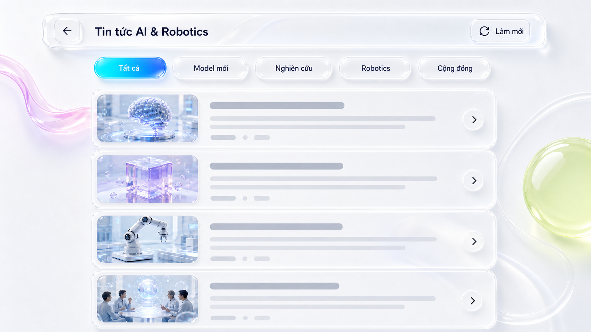

# Tin tức AI & Robotics — White Liquid Glass

**Date:** 2026-07-28  
**Status:** Approved visual direction; awaiting review of this written spec  
**Scope:** Restyle the News page only. Its visual theme is intentionally independent from the application-wide light/dark theme.

## Visual acceptance reference



This image is the composition and material reference for implementation. It is not a screenshot that the code is expected to reproduce pixel-for-pixel, but the finished desktop page must clearly read as the same design system:

- an almost-white pearl canvas;
- thick, clear, rounded liquid-glass surfaces;
- cool blue/cyan active state;
- one lilac liquid ribbon at the far left and one lime lens/orb at the far right;
- quiet article panels on top of the composition.

## Purpose and success criteria

The existing page functions correctly but reads as a conventional translucent dashboard. The redesign turns it into a deliberately composed, editorial news surface that feels like a tactile liquid-glass object while keeping Vietnamese news content readable and the list easy to scan.

Success means that, at a 1440px-wide desktop viewport, a person can compare the page against the reference above and recognize the same hierarchy, white material system, and spatial composition before reading the text. It must not become a generic dark-glass page, a flat white card list, or a colored-gradient background with cards placed over it.

## Theme contract

`NewsPage` owns a local visual canvas and always renders in the white liquid theme:

- It ignores the application `data-theme` value for its page background, surfaces, and text colors.
- The app shell may remain dark; entering `/news` must still show the white canvas.
- The page itself owns all sufficient text and focus contrast. Global dark-mode tokens cannot bleed into it.
- Returning to other routes restores their ordinary app theme without changes.

This is a deliberate route-level art direction, not a new global light theme.

## Information architecture

The data contract, topic filtering, refresh/cooldown behavior, external article links, and scrolling behavior remain unchanged.

```
News canvas
├── decorative background objects (non-interactive, behind all content)
├── glass command bar
│   ├── back button
│   ├── page title
│   └── refresh button + loading state
├── topic tabs
├── status / error / empty message
└── scrollable article list
    └── article card
        ├── topic visual thumbnail
        ├── title and summary
        ├── topic / source / time metadata
        └── external-link affordance
```

## Desktop composition

### Canvas and decorative objects

- Use a pearl-white base with a very soft cool-blue edge falloff. This is a page-local palette, expressed as dedicated News CSS variables rather than global token overrides.
- Place a translucent lilac/pink ribbon partly offscreen at the left, aligned with the top of the article area. It has a visible inner highlight, outer rim, and diffuse shadow; it is not a flat gradient stripe.
- Place a large lime-green glass lens/orb partly offscreen at the right. A faint clear loop/ring can frame it. Both are background-only and never overlap readable content at common desktop widths.
- Add only subdued contour rings and specular reflections elsewhere. The ribbon and lens are the signature elements; no extra floating decoration competes with them.

### Command bar and tabs

- Center content in a maximum-width composition of approximately 1,280px, with the command bar spanning the composition width.
- The command bar is a 76–88px high clear glass capsule with a thick, double-looking rim: bright top/left inner highlight, cool-grey outer edge, and soft blue cast shadow.
- Back and refresh controls are independent raised glass controls. The refresh label stays `Làm mới`; loading retains its current functional state.
- Tabs sit beneath the command bar as individual raised capsules, not a segmented control. The selected tab is cyan-to-blue liquid fill with a small soft glow; inactive tabs stay almost-white glass.

### Article cards

- Cards are horizontal panels approximately 170–190px high on desktop and use the same clear rim language as the command bar, with slightly quieter shadow.
- A topic visual thumbnail occupies the left side. It is decorative orientation only: a fixed local art asset selected by topic (`model_release`, `research`, `robotics`, `community`) and has an empty alt text. It does not claim to represent the linked article.
- Text remains actual data: Vietnamese title, summary, topic, source, and relative time. No text may be rendered into an image.
- An arrow affordance at right visually signals the external link, but the whole card title/link remains keyboard and mouse accessible. The link does not gain an extra hidden navigation target.
- If an image asset fails or is unavailable, the thumbnail area renders a neutral blue glass placeholder; text alignment and card height do not change.

## Responsive behavior

- **Desktop (>= 1,100px):** full ribbon, right lens, horizontal cards with thumbnail and arrow affordance.
- **Tablet (700–1,099px):** reduce the decorative crop and card width; retain horizontal card structure.
- **Mobile (< 700px):** hide the large right lens and crop the ribbon heavily. The command bar remains a compact capsule. Cards become vertical, with the thumbnail at the top, without horizontal overflow. Tabs scroll horizontally if necessary rather than compressing labels.
- Page scrolling belongs to `NewsPage` and must work with wheel, keyboard, touch, and a visible scrollbar where the browser shows one. Decorative layers use `pointer-events: none`.

## Interaction, motion, and accessibility

- Use only short opacity/transform transitions for hover and focus; do not animate page layout, filter blur, or shadows continuously.
- Article cards lift by at most 2px; controls use a subtle raised-state change. Respect the existing reduced-motion blanket.
- Every interactive control has a clear keyboard focus ring against the white surface.
- Article text, tabs, controls, source, and time meet contrast requirements on the local white canvas. Decorative color must never carry meaning by itself.
- `aria-hidden` is applied to all decorative layers and topic thumbnails. Existing labelled buttons keep their accessible names.

## Implementation boundaries

### New News-local primitives

- `NewsLiquidCanvas`: background and non-interactive liquid objects.
- `NewsCommandBar`: structural wrapper around the existing back/title/refresh controls.
- `NewsTopicTabs`: existing filter behavior with revised visual treatment.
- `NewsCard`: presentational structure for a topic thumbnail, content, metadata, and external-link affordance.

These can remain in `NewsPage.tsx` if they stay small; extract only when it makes tests and accessibility clearer. The API and `useNews` hook are out of scope.

### Styles and assets

- Keep CSS in `frontend/src/styles/news.css`; do not reorder `styles.css` imports.
- Add route-local `--news-*` variables inside `.news-page` for white-canvas colors, glass rims, and shadow layers. Do not alter global dark/light tokens.
- Generate four small, non-branded topic thumbnail assets and place them in `frontend/src/assets/news/`. Each must be an abstract AI/robotics image with no embedded words or logos.
- The acceptance-reference image above belongs to the spec only; it is not shipped by the frontend.

## Test and verification plan

1. Add component tests before implementation for the local canvas, article thumbnail fallback, and arrow affordance without changing existing fetch/filter/refresh coverage.
2. Verify all existing `NewsPage` tests pass, including title/summary fallbacks and cooldown behavior.
3. Run TypeScript validation and a production frontend build to catch CSS asset paths.
4. Inspect the actual page at desktop, tablet, and mobile widths, in both application theme settings, confirming the News route stays white.
5. Inspect focus states and reduced-motion mode in the browser.

## Explicit non-goals

- No changes to backend news ingestion, translation, refresh cooldown, or database data.
- No global theme migration and no changes to the landing page or sidebar.
- No per-article image fetching, external image URLs, or misleading article-specific AI imagery in this iteration.
- No autoplaying animation, parallax, or decorative layer that can capture pointer input.

## Acceptance checklist

- [ ] `/news` is white liquid glass in both application light and dark mode.
- [ ] The desktop composition visibly contains the left liquid ribbon, right lime lens, raised command bar, raised tabs, and quiet glass article panels.
- [ ] Existing news fetch, topic filters, refresh, cooldown, fallback text, external links, and scrolling still work.
- [ ] Desktop, tablet, and mobile layouts have no overlap or horizontal page overflow.
- [ ] Keyboard focus, contrast, and reduced-motion behavior are verified.
- [ ] Automated tests, TypeScript validation, and production build pass.
